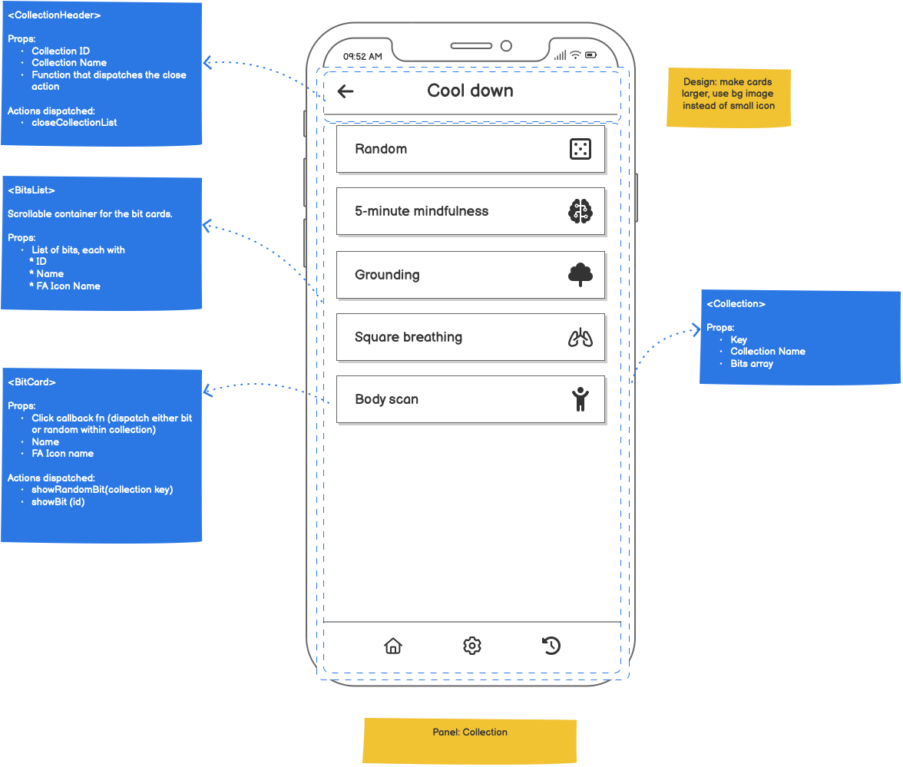

# About the app

A mobile app based on React Native that offers exercises to wake up, improve focus and cool down. [The mockups](https://github.com/noelrivasc/note-to-self/blob/main/ux-mockups/NoteToSelf-v0.2.pdf) may give you a better idea.

I named it _Note To Self_ because there are some "rituals" that I'd like to do more often but usually forget once I get focused on something. Eventually, the backend should allow me (or anyone else) to quickly add or change the _Notes_.

Some examples: 

* Mindfulness
* Get up and do some juggling 
* Stretch
* Guided apnea training

Each exercise will be a simple audio, accompanied by a text description.

# Syllabus

This app will serve as a learning exercise and testing ground for React, React Native and related technologies.

This is what I'll be using:

* TypeScript
* React
* Redux
* React Native (targets: iOS and Android)
* The tooling around React Native
* Testing with Jest

# Out of syllabus

Things I'm not attempting to learn or use at this point:

* ~~Jest or any other testing framework or technique~~
    * 🤔 Actually, Jest is the easiest way to test the store

# Unusual technical decisions

For an app being written in 2023, some technical decisions may be strange. Here's an explanation of the ones I can think of.

## Using class components in React

Instead of using functional components — which are what the new React docs recommend — I opted for class components. The reason is that I feel much more comfortable writing JS classes than writing React hooks, so if eventually I need to do something that isn't natural with React hooks, I would need to learn how to implement custom ones, and that doesn't seem trivial.

## Not using Redux toolkig

I decided to use Redux the old way. My goal with this exercise is to understand the technologies and how they play together; by using some of toolkit's functions (ie: mutating the state directly and letting it figure out the correct way to produce a new state) I would be relying one some magic instead of understanding the foundation.

## Using promises instead of async / await

😳 I haven't had the time to read about async / await yet; found it easier to use Promises directly but may rewrite those portions later.
